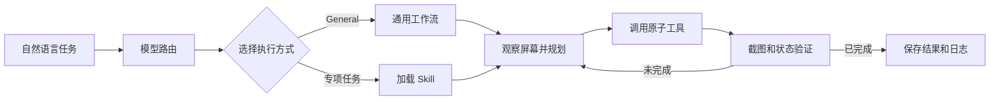

# Desktop App Control Agent

这是一个 Windows 桌面智能体。给它一句自然语言任务，它会自己看屏幕、拆步骤，再用 PyAutoGUI 操作鼠标和键盘。

目前通用的桌面操作已经可以跑起来，另外还单独做了网页视频播放和论文翻译两个 Skill。执行过程会记录下来，方便回头看它每一步做了什么、为什么成功或者失败。

> 项目还在继续调整。屏幕缩放、窗口遮挡、网站改版、网络状态和模型输出都会影响实际效果。

## 现在能做什么

- 用自然语言下达桌面任务
- 根据当前截图判断下一步操作
- 用 10×10 网格辅助定位鼠标目标
- 对比操作前后的截图，检查点击是否生效
- 结合 Windows 进程和窗口信息确认应用是否打开
- 单独检查音乐播放状态，避免把暂停当成正在播放
- 连续检查网页视频画面，判断播放器是否真的在运行
- 随时按 Esc 停止任务
- 按任务保存操作 JSON、截图和最终结果

## 大致流程



一次任务基本会走下面这些步骤：

1. **任务路由**：先判断走通用流程还是专项 Skill。
2. **执行确认**：展示准备执行的内容，确认后再开始操作。
3. **观察与规划**：读取当前屏幕，决定下一步用哪个工具。
4. **执行操作**：一次只做一个动作，方便记录和限制。
5. **检查结果**：重新截图，或者读取窗口、媒体状态，判断任务有没有完成。
6. **保存日志**：把参数、操作说明、截图和最终结果放到同一个任务目录里。

## 工作流与 Skill

### General 通用工作流

打开应用、网页搜索、点击控件、输入文字和音乐播放等任务默认走 General。每一步都会根据最新截图重新规划，同时限制最大规划轮数、操作总数和单个工具的调用次数。

音乐播放虽然也从 General 进入，但搜索歌曲和检查播放状态走的是单独写好的流程，主要是为了减少重复搜索和误点。

### Web Video Playback

`web-video-playback` 用来在视频网站里找指定内容并播放。它会整理视频名称、目标平台和浏览器信息，再通过两张连续截图检查播放器状态。广告、片头或者正片只要确实在连续播放，就可以判定任务完成。

### ChatGPT Paper Abstract

`chatgpt-paper-abstract` 用来查找桌面上的论文，并在 ChatGPT 中翻译 Abstract 和 Section 1～5。它会先匹配论文文件，再准备分段信息，最后检查回答是否已经生成完成。

## 项目结构

```text
desktop-app-control/
├── desktop_agent/          # Agent 核心代码
│   ├── agent.py            # 任务创建、确认和执行入口
│   ├── workflows.py        # 通用工作流与规划循环
│   ├── routing.py          # 模型路由
│   ├── vision.py           # 截图、视觉请求和目标定位
│   ├── runtime.py          # 运行时和操作次数控制
│   ├── skills.py           # Skill 发现与加载
│   ├── escape.py           # Esc 强制停止
│   └── tools/              # 鼠标、键盘、应用、音乐等工具
├── skills/                 # 专项 Skill、说明和检查脚本
├── tests/                  # 自动化测试与独立脚本测试
├── example/                # 音乐和视频演示脚本
├── public_logs/            # 经过脱敏的示例执行记录
├── docs/                   # Skill 与路由开发说明
├── desktop_app.py          # 图形任务输入窗口
├── main.py                 # 项目配置和命令行入口
├── launch_agent.ps1        # Windows 图形界面启动脚本
└── pyproject.toml          # Python 包和依赖配置
```

## 环境要求

- Windows 10 或 Windows 11
- Python 3.10 及以上版本
- DeepSeek API Key
- 建议单独建一个虚拟环境或 Conda 环境

## 安装

克隆项目后，在项目根目录执行：

```powershell
python -m venv .venv
.\.venv\Scripts\Activate.ps1
python -m pip install --upgrade pip
python -m pip install -e .
```

依赖写在 `pyproject.toml` 里，主要用到了 Pillow、PyAutoGUI、pyperclip 和 Windows Media Control 相关的 WinRT 包。

## 配置 API Key

程序从 `DEEPSEEK_API_KEY` 环境变量读取密钥。

只在当前 PowerShell 窗口中设置：

```powershell
$env:DEEPSEEK_API_KEY = "你的 API Key"
```

保存到当前 Windows 用户的环境变量：

```powershell
[Environment]::SetEnvironmentVariable(
    "DEEPSEEK_API_KEY",
    "你的 API Key",
    "User"
)
```

第二种方式设置后，重新打开终端就会生效。

## 运行方式

### 命令行

```powershell
python main.py run "打开我的钉钉"
python main.py run "我要听挪威的森林" --yes
python main.py run "我要看复仇者联盟" --yes
```

安装项目后也可以直接运行：

```powershell
desk-agent run "打开 Edge 搜索北京理工大学"
```

如果只想看路由和确认结果，不实际操作桌面：

```powershell
python main.py run "打开 Edge 搜索北京理工大学" --dry-run
```

### 图形任务窗口

```powershell
python desktop_app.py
```

也可以双击 `launch_agent.bat`。窗口里按 Enter 提交任务；任务开始后窗口会自动最小化，结束后再恢复。运行期间按 Esc 或点击“终止”都可以取消。

### 演示脚本

```powershell
.\example\run_general_demo.ps1
.\example\run_video_demo.ps1
```

跑演示前最好先确认浏览器、QQ 音乐和网络都正常，并尽量不要让其他窗口挡住目标应用。

## 主要配置

常用配置都在 `main.py`，部分配置也可以通过命令行参数临时覆盖。

| 配置 | 默认值 | 说明 |
| --- | ---: | --- |
| `MODEL` | `deepseek-v4-flash-vision-exp` | 路由、规划和视觉识别模型 |
| `MIN_CONFIDENCE` | `0.75` | 视觉定位最低置信度 |
| `MAX_STEPS` | `40` | 最大规划轮数 |
| `MAX_ATOMIC_OPERATIONS` | `50` | 最大原子操作数 |
| `GRID_ROWS` / `GRID_COLUMNS` | `10 × 10` | 辅助定位网格 |
| `ACTION_PAUSE` | `0.3` 秒 | 每次操作后的基础停顿 |
| `OBSERVATION_DELAY` | `0.6` 秒 | 操作后重新截图前的等待 |

常用命令行参数：

| 参数 | 作用 |
| --- | --- |
| `--yes` | 确认通过后自动批准本次任务 |
| `--dry-run` | 只显示路由和确认结果，不执行操作 |
| `--max-steps` | 临时修改最大规划轮数 |
| `--max-operations` | 临时修改最大原子操作数 |
| `--min-confidence` | 临时修改视觉置信度阈值 |
| `--full-trust` | 跳过人工批准，保留硬性限制 |
| `--logs-dir` | 指定日志保存目录 |

## 原子工具

主要工具都在 `desktop_agent/tools/`：

| 文件 | 功能 |
| --- | --- |
| `applications.py` | 搜索、启动、恢复和检查桌面应用 |
| `keyboard.py` | 输入文本、按键、组合键和提交搜索 |
| `mouse.py` | 视觉定位、点击、双击和滚动 |
| `music.py` | QQ 音乐搜索与播放状态处理 |
| `media_session.py` | 读取 Windows 媒体会话 |
| `grid.py` | 生成辅助定位网格 |
| `system.py` | 可取消的等待操作 |
| `files.py` | 查找桌面文件 |
| `skill_scripts.py` | 加载 Skill 提供的独立工具脚本 |

## 日志

每次任务的完整记录默认放在：

```text
logs/时间_任务简介/
├── images/       # 操作后截图和网格图
├── json/         # 任务、路由、确认和最终结果
└── operations/   # 每项操作的参数、说明和结果
```

`logs/` 默认不会提交到 Git。仓库里的 `public_logs/` 只放了少量经过筛选和脱敏的示例，用来展示实际执行过程。

## 测试

```powershell
python -m unittest discover -s tests -p "test_*.py" -v
python skills/manage.py check
python -m pip check
```

## 开发 Skill

Skill 放在 `skills/<skill-name>/`，通常是下面这个结构：

```text
skill-name/
├── SKILL.md
├── skill.py
├── agents/openai.yaml
└── scripts/
    ├── inspect_state.py
    └── inspect_state.tool.json
```

`SKILL.md` 写适用场景、执行步骤和完成条件，`skill.py` 提取任务变量，`scripts/` 放可以单独运行的检查工具。更详细的写法在 `docs/SKILL_AND_ROUTING_GUIDE.md`。

## 已知问题

- 目前主要在 Windows 上开发，没有专门适配 macOS 和 Linux
- 视觉点击会受到屏幕缩放、分辨率、窗口位置和界面改版影响
- 有些应用读不到系统媒体状态，只能结合截图变化判断
- 网络或模型 API 中断时，规划和视觉检查会失败
- 网站登录、验证码、会员和地区限制仍然需要手动处理

## 许可证

代码使用 [MIT License](LICENSE)。
